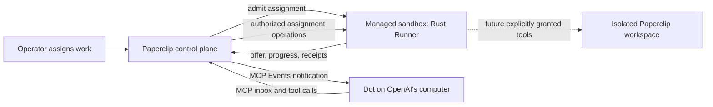

# Cloud Dot runners and external-agent invitations

Date: 2026-10-08

Status: the live self-hosted invitation flow is implemented. The shared square picker and animated dialog now create/resume scoped invitations, preserve company approval, watch server state, and send the event test automatically. Dot driver launcher/checkpoint hooks are qualified with a real Rust process. **Cloud execution remains disabled:** the existing managed-environment and Cloud MCP guards are unchanged pending sandbox and tenant-ingress qualification.

## Decision: remote agents use the new Runner infrastructure

Keep Dot and future remote-agent drivers within the new Rust Runner infrastructure. A remote agent can do its thinking and computer work elsewhere while Paperclip still owns admission, assignment lifecycle, tool authorization, receipts, progress, cancellation, and completion through the same Runner contract used by other agents.

There is also a deliberate future benefit: **we may give remote agents tools that access a Paperclip workspace. Those tools require sandbox isolation.** Keeping remote agents on the Runner infrastructure gives those future tools an established execution boundary, workspace lifecycle, and authorization path. We should not need to invent a second execution system when a remote agent gains workspace capabilities.

Where the Runner runs and which tools the agent receives are independent decisions. Running a Runner in a sandbox does not itself grant Dot filesystem or shell access. The tool catalog and per-run grants determine that access.

For the first cloud implementation:

- Dot uses its own OpenAI-hosted computer. Do not expose Paperclip workspace file or command tools to it.
- Start one ordinary managed Runner execution job for an admitted assignment, using the configured cloud sandbox provider (for example, Kubernetes or Daytona). Reuse the job for that assignment's messages and tool calls.
- Do not start a new sandbox for each message or tool call. Do not require an idle, always-running sandbox just to receive Dot traffic.
- Do not run agent-provided commands on the Paperclip control-plane host. Future workspace tools execute inside the assignment's managed sandbox and require explicit capability grants.
- Keep public MCP, OAuth, subscription handling, and durable mailbox state on the control plane. These remain reachable while no Runner job is active.

The control plane authenticates inbound Dot requests even when no assignment exists. Idle reads and connection checks need no sandbox. A request to start work creates a visible task and passes normal admission before launching a job. During an assignment, the control plane routes operations to its owning Runner through the durable bridge. Progress and completion return through normal Runner bookkeeping. After completion or cancellation, tear down the job according to the managed execution policy; keep the binding and mailbox.

This preserves one lifecycle without promising that every provider performs identical work. For Dot, much of the driver coordinates a remote service. For a local coding agent, the driver also supervises a local process. Workspace access can be added later without weakening the boundary between the control plane and execution.

## Invitation walkthrough

Entry: **New agent → Invite an external agent → Dot / Hermes / Other**.

The picker uses square cards matching the harness picker, with the Dot and Hermes brand marks. The shared dialog animates content-height changes without scaling text and respects reduced-motion preferences. The Dot option is governed by the standalone Dot experimental setting and its required Assistant connections (MCP) dependency in the live controller. Experimental infrastructure prerequisites belong in settings, not as a list of implementation details in this invitation.

1. Choose **Dot**. Paperclip creates a company/agent-scoped invitation and a short-lived pairing prompt.
2. Show **Copy setup prompt**, using the shared `AgentSetupPrompt` component with the Dot mark. Tell the user to send the whole prompt to their Dot in ChatGPT. The preview remains inspectable and offers selectable text if clipboard access fails.
3. Dot follows the prompt to install or reuse the private plugin, complete scoped OAuth consent using the one-use pairing code, read its inbox, and subscribe to updates. Retain the exact user-approved plugin-creation consent wording from the existing prompt. The pairing code must remain transient and must not be logged, committed, or stored in browser persistence.
4. Paperclip watches the connection and updates three checks in place:
   - **Connected to Paperclip** — the scoped OAuth/binding connection is established.
   - **Task updates enabled** — the event subscription/callback is verified.
   - **Test event confirmed** — Paperclip sent a readiness challenge through the event path and the paired Dot explicitly confirmed it through MCP.
5. Show **Your Dot is connected** and **Done** only after the round trip is confirmed. A successful copy, OAuth connection, or subscription alone is insufficient.

The event delivery worker automatically issues the readiness test once the subscription is verified. It must be idempotent across refreshes/reconnects, correlate confirmation to the current binding and challenge, and never mark a replacement binding ready using an old confirmation. Use server events or bounded polling with reconnect/revalidation. UI timers are not evidence of success.

When the event test times out, preserve completed checks and offer **Retry test event**. When the pairing code expires, automatically prepare a fresh prompt, invalidate the old prompt, and make the new one available to copy. When watching is interrupted, state that updates are paused and offer **Reconnect updates**; do not imply Dot itself disconnected. Returning to the picker must preserve a pending invitation rather than silently create duplicate agents or codes. Closing the dialog must not revoke an established connection.

The managed invitation authorizes only the selected agent in the selected company; it does not grant operator access. OAuth scope preview and consent remain part of connecting. This flow should not require the operator to manipulate Dot's computer or manually run an event test.

## Hermes and Other

Hermes is a named choice with its existing brand mark. **No new Hermes protocol, tools, transport, authentication, or setup behavior is part of this work.** Hermes and Other use the same existing `buildAgentOnboardingPrompt` output, including its Hermes Gateway guidance and existing board approval/key-claim sequence. They do not show Dot's MCP event checks or claim readiness from a copied prompt.

## Reviewable Storybook surface

Folder: `ui/storybook/stories/external-agent-invite/`.

- **Onboarding / External agent invitation / Journeys**: entry, picker, copy handoff, individual watched states, success, timeout/retry, expiration, interrupted updates, Hermes, Other, mobile, light theme, and long company names.
- **Onboarding / External agent invitation / Components**: picker and each controlled connection-check state.
- Interaction stories exercise copy → watched progression → success, retry without discarding completed checks, and measured intermediate heights while the modal expands and contracts.

The shared presentation lives in `ui/src/components/new-agent/ExternalAgentInviteContent.tsx`. Storybook alone supplies timers and fixture credentials at `.example` URLs. It uses the live Dot prompt unchanged, including automatic readiness testing. The prompt optionally asks Dot to upload its own avatar using `paperclip_dot_set_avatar`; avatar availability does not block pairing. Hermes and Other reuse the production invitation builder without modifications.

Run `pnpm --filter @paperclipai/ui storybook`, then open the journey group. Copying in the interactive Dot story advances simulated checks; the fixed-state stories remain still for inspection. These stories illustrate the live UX with simulated connection evidence; they do not prove a live cloud pairing.

## Remaining implementation and qualification

The live invitation controller, owner-scoped pending-invitation lookup, atomic creation, pending-code replacement, automatic event test, feature gating, and watcher are implemented. Active run controllers poll durable operation rows under their current controller generation and lease, so an operation reserved by another HTTP replica reaches its owning Runner. Idle-initiated work already uses normal admission.

Before shipping cloud, connect Dot's qualified launcher hooks to managed job dispatch and qualify the dedicated tenant MCP ingress. Keep the present cloud restrictions until those paths are proven. The optional external launcher uses target-owned provider checkpoints and refuses recovery when identity or state is missing; it does not invent a replacement Dot thread. Preserve company isolation, approval rules, budget stops, assignment authority, and mutation receipts. Qualify real OAuth installation, event round trip, assignment execution, unsolicited Dot work, restart/reconnect, cancellation, and expired/revoked credentials against a real sandbox provider. No cloud-ready claim follows from this Storybook pass.

## Implemented invitation semantics

- `POST /api/companies/:companyId/dot-invitations` finds or creates one unfinished Dot invitation for the signed-in operator. Creation holds a company row lock and commits the agent, membership, grants, approval (when required), and audit entries atomically. The fixed preset disables workspace/attachment access and periodic wakes; normal on-demand admission remains available.
- `GET` on that path returns the operator's unfinished invitation without a pairing secret. The dialog's existing binding query reports pairing/test expiry and agent approval state.
- Pairing codes stay in component memory and out of React Query's mutation results. After refresh, the UI checks current connection state and automatically creates a fresh prompt for an unfinished pairing. Expiry while the dialog is open also renews automatically; failures offer a retry without an automatic retry loop. Replacing a prompt requires the exact pending binding ID and its issuing operator; a concurrent completed OAuth connection is not revoked.
- The delivery worker creates one readiness challenge after callback verification under the binding row lock. Refreshing, reconnecting, or repeating a worker tick does not replace that challenge. An expired test needs an explicit retry. A revoked generation cannot confirm it.
- Hermes and Other share the existing external-agent invitation API and unchanged onboarding prompt. Dot is no longer a separate card in the harness picker.

Verification: a disposable authenticated local instance exercised the natural New Agent entry, Dot prompt copy, Back, Hermes, refresh/resume, and pending-prompt replacement. Signed callback verification, nonce confirmation, scoped OAuth, actual Rust execution, duplicate receipts, and recovery have automated coverage. No real OpenAI Dot or managed cloud sandbox was connected during this implementation pass.
